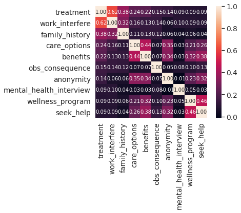
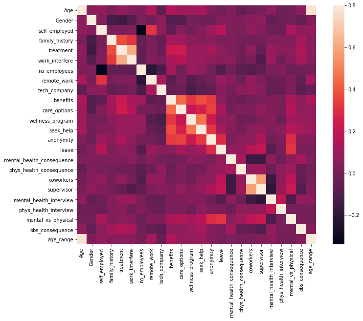
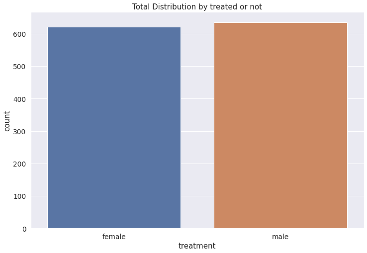
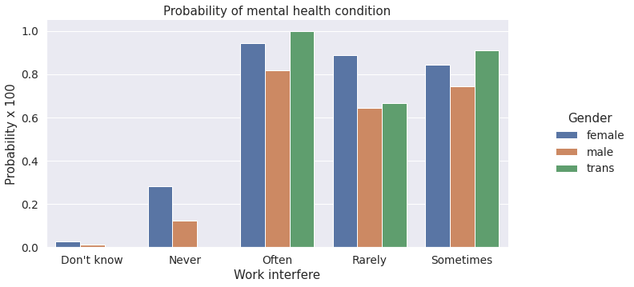
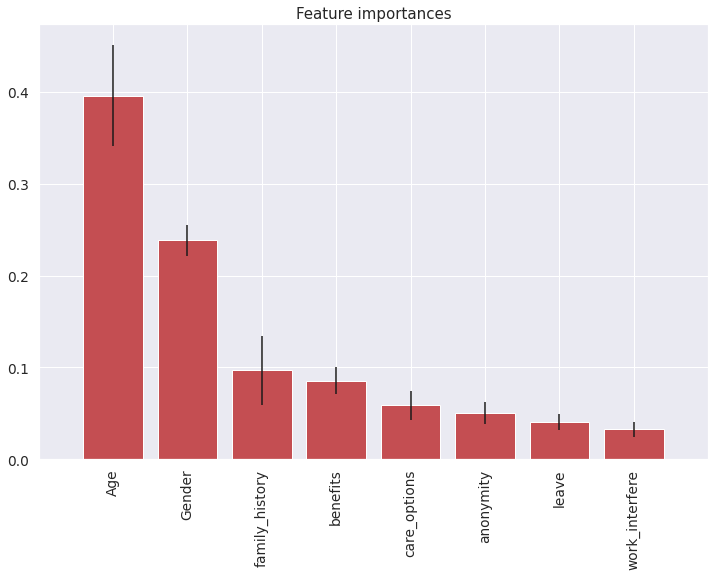
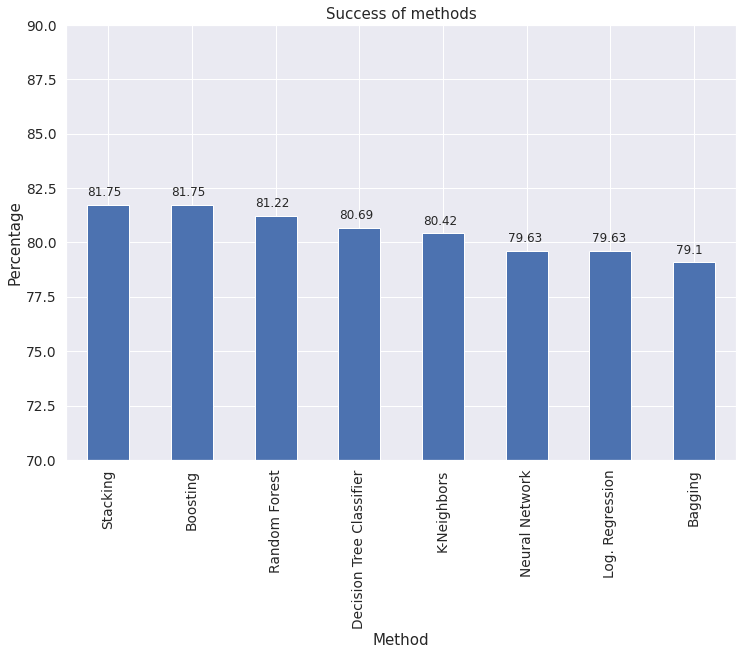

# MentalVue Analysis

A machine learning project predicting whether a tech-industry employee is likely to seek mental health treatment, based on the **OSMI Mental Health in Tech Survey** (2014). Covers data cleaning, exploratory analysis, and a comparison of 8 classification algorithms.

## Overview

The dataset captures workplace attitudes and conditions around mental health — company benefits, anonymity protections, willingness to discuss mental health with a supervisor, family history, and more — from **1,259 respondents across 27 fields**. The goal: predict the binary `treatment` target (has the respondent sought treatment for a mental health condition?) and identify which workplace/personal factors matter most.

## Project Workflow

```
Raw survey.csv (1,259 rows × 27 columns)
        │
        ▼
Data Cleaning
  • dropped high-null / low-signal columns (comments, state, Timestamp)
  • normalized 40+ free-text Gender entries into male / female / trans buckets
  • capped Age to a sane 18–120 range, imputed with median
  • imputed self_employed / work_interfere nulls using each field's dominant class
  • label-encoded all categorical fields
        │
        ▼
Exploratory Analysis
  • correlation matrix across all encoded features
  • treatment probability breakdowns by age, family history, care options,
    benefits, and work interference
        │
        ▼
Modeling — 8 classifiers compared on held-out test data
  Logistic Regression · KNN · Decision Tree · Random Forest ·
  Bagging · Boosting (AdaBoost) · Stacking · Neural Network (TensorFlow DNN)
        │
        ▼
Best model (Stacking / Boosting) used to generate test-set predictions
```

## Repo Structure

| File | Purpose |
|---|---|
| `predictionUsingML.ipynb` | Full pipeline: cleaning, EDA, model training/tuning, evaluation |
| `mental_health.py` | Imports for the classifier stack (Logistic Regression, KNN, Random Forest, Naive Bayes, Stacking) |
| `data/survey.csv` | Raw OSMI Mental Health in Tech survey data |

## Data Cleaning Highlights

- **Gender free-text normalization**: raw survey allowed open text (`"Male"`, `"m"`, `"Cis Male"`, `"something kinda male?"`, etc.) — consolidated into consistent male/female/trans categories before encoding.
- **Age outlier handling**: a small number of invalid ages (negative, or in the thousands) were capped and replaced with the median.
- **Missing-value imputation**: `self_employed` and `work_interfere` nulls (each under ~20% of rows) filled with the field's most common value rather than dropped, to preserve sample size.
- **Feature selection**: `comments`, `state`, `Timestamp`, and `Country` dropped — free text, high cardinality, or low predictive signal.

## Findings

**1. `work_interfere` and `family_history` are the strongest linear predictors of treatment-seeking**
Among all encoded features, `work_interfere` correlates with `treatment` at **0.62** and `family_history` at **0.38** — well above every other field (`care_options`, `benefits`, etc. all under 0.25).




**2. The target class is well balanced**
637 respondents reported having sought treatment vs. 622 who hadn't — a close to 50/50 split, which avoids the class-imbalance problems that would otherwise distort accuracy as a metric.



**3. How work interferes with productivity is a strong signal, regardless of gender**
Respondents who said mental health issues interfere with work "Often" have a treatment probability above 80% across every gender group, versus under 30% for "Never" — the workplace-interference signal dominates the demographic split.



**4. Tree-based feature importance ranks Age and Gender highest — a useful contrast to the correlation view**
An ExtraTreesClassifier trained on the modeling feature set ranks `Age` and `Gender` as the top two features by importance, ahead of `family_history` and `work_interfere` — a reminder that linear correlation and tree-based importance don't always agree, and both are worth checking before trusting a single feature-ranking method.



**5. Ensemble methods (Stacking, Boosting) edge out simpler models, but the gap is small**
All 8 models land within a **~2.6 percentage-point band (79.1%–81.75%)** on held-out accuracy. Stacking and AdaBoost tie for best at 81.75%, with plain Bagging lowest at 79.1% — meaningful, but not a dramatic gap, suggesting the dataset's signal ceiling is around 80–82% regardless of algorithm choice.



## Tech Stack

- **Python**: Pandas, NumPy for cleaning and feature engineering
- **Matplotlib / Seaborn**: correlation heatmaps, distribution and probability plots
- **scikit-learn**: Logistic Regression, KNN, Decision Tree, Random Forest, Bagging, AdaBoost, `ExtraTreesClassifier` for feature importance, `GridSearchCV` / `RandomizedSearchCV` for tuning
- **mlxtend**: `StackingClassifier`
- **TensorFlow**: `DNNClassifier` for the neural network comparison

## How to Run

```bash
git clone https://github.com/nayak-siddarth/mentalvue-analysis.git
cd mentalvue-analysis
pip install pandas numpy matplotlib seaborn scikit-learn mlxtend tensorflow

jupyter notebook predictionUsingML.ipynb
```

The notebook expects `data/survey.csv` in place — update the `pd.read_csv(...)` path if you move the dataset.

## License

See [LICENSE](./LICENSE).
